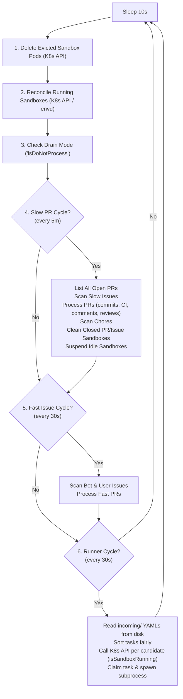

# Factory Watch: Subcontroller Architecture & Asynchronous Orchestration

| Metadata | Details |
| :--- | :--- |
| **Status** | Implementable |
| **Author(s)** | Sam Dowell (`sdowell@google.com`) |
| **Created** | 2026-08-31 |
| **Last Updated** | 2026-08-31 |

This document proposes a decoupled, asynchronous subcontroller architecture for the `factory watch` command. It details the motivation, structural design, shared memory model, concurrency controls, lifecycle management, and a gradual implementation plan.

---

## 1. Overview & Goals

The `factory watch` daemon serves as the central background orchestration engine for the AI Factory. It continuously monitors GitHub repository activity (issues, pull requests, review comments, CI check failures) and scheduled chores, translating them into sandbox execution tasks executed via child `factory` CLI processes.

### Primary Objectives
* **Lower Pickup & Dispatch Latency**:
  * Reduce newly assigned/created issue pickup latency from **O(minutes-hours) down to O(seconds)**.
  * Reduce task scheduling latency to **at most one dispatch interval**, by dispatching from an in-memory queue on a dedicated loop that is never blocked behind scan cycles.
* **Decoupled Separation of Concerns**:
  * Break down the monolithic loop into **5 dedicated, autonomous subcontrollers** running in isolated goroutines coordinated by a shared context.
  * Enforce strict, uni-directional dependencies to prevent circular cross-controller calls.
* **Shared In-Memory State with Disk Write-Through**:
  * Maintain queue state, sandbox leases, and repository metadata in thread-safe memory primitives (`TaskQueueManager`, `SandboxLockRegistry`, `EntityStateCache`).
  * Ensure disk write-through persistence (`incoming/`, `processing/`, `processed/`, `journal.jsonl`) for crash recovery, CLI inspection, and observability.
* **Fault Isolation & Non-Blocking Execution**:
  * Prevent slow GitHub API endpoints (e.g., paginating PR comments or rate limit pauses) or slow Kubernetes API calls (sandbox pod reconciliation, cleanup) from blocking issue scanning or task execution.

---

## 2. Problem Statement & Motivation

### Current Monolithic Architecture
Currently, `Watcher.Run()` executes a single sequential loop governed by a 10-second sleep timer:



### Core Bottlenecks
1. **Head-of-Line Blocking**:
   Evaluating pull requests requires numerous sequential GitHub REST calls (`ListAllCommits`, `ListAllIssueComments`, `ListAllReviews`, `ListAllReviewComments`, `ListAllCheckRuns`, `ListAllStatuses`). If a repository has several active PRs or GitHub experiences latency, PR processing can block the entire thread for 30–60 seconds, halting issue discovery and task dispatching.
2. **Two-Stage Dispatch Lag**:
   An issue created immediately after a fast scan cycle must wait up to 30s for the next scan cycle to be written to `incoming/`, and then another 30s for the runner loop to pick it up, resulting in **60s to 90s+ total delay**.
3. **Repetitive Disk I/O and YAML Deserialization**:
   Every 30-second runner cycle and every HTTP query to `/api/v1/queue` re-reads all files across `incoming/`, `processing/`, and `processed/` directories on disk, parsing each YAML file individually.
4. **Synchronous Kubernetes Status Probing**:
   Candidate queue tasks are verified for sandbox availability via synchronous Kubernetes API queries (`isSandboxTaskRunning`) inside the critical runner loop, causing dispatch delay to scale with queue size and cluster latency.

---

## 3. Proposed Architecture

The daemon will be rearchitected into **5 decoupled subcontroller goroutines** plus an HTTP server, running concurrently under a shared root context. The subcontrollers coordinate entirely through thread-safe in-memory primitives:

```mermaid
flowchart TB
    subgraph External["External Systems"]
        GH["GitHub REST API"]
        K8S["Kubernetes API / Envd"]
    end

    subgraph Controllers["Autonomous Subcontroller Goroutines"]
        ISC["Issue Scanner<br/>(Single Cycle: 30s-60s)"]
        PSC["PR Scanner<br/>(Single Cycle: 1m-2m<br/>+ Worker Pool)"]
        CSC["Chore Scheduler<br/>(Dedicated Cron Timers)"]
        TQD["Task Dispatcher<br/>(Dedicated Ticker: 30s)"]
        SGC["Sandbox Reconciler & GC<br/>(Ticker: 30s-60s)"]
        SRV["Queue HTTP Server<br/>(:13338 /api/v1/queue)"]
    end

    subgraph SharedMemory["Shared Thread-Safe In-Memory State"]
        TQM["TaskQueueManager<br/>- incoming / processing / processed maps<br/>- fair-share sorter, RWMutex"]
        ESC["EntityStateCache<br/>- open PRs, referenced issues<br/>- processed state (SHAs, timestamps)<br/>- RWMutex"]
        SLR["SandboxLockRegistry<br/>- in-flight sandbox lease table<br/>- Mutex"]
    end

    subgraph Storage["Durable Disk Storage (Write-Through)"]
        FS_INC["queue/incoming/*.yaml"]
        FS_PROC["queue/processing/*.yaml"]
        FS_DONE["queue/processed/*.yaml"]
        FS_JRNL["queue/journal.jsonl"]
    end

    %% Ingestion Flow
    ISC -->|"1. Fetch open issues"| GH
    ISC -->|"2. Check referenced PRs O(1)"| ESC
    ISC -->|"3. Enqueue issue-fix"| TQM

    PSC -->|"1. Fetch PRs, reviews, CI"| GH
    PSC -->|"2. Update open PRs & metadata"| ESC
    PSC -->|"3. Enqueue pr-tasks"| TQM

    CSC -->|"1. Read .agents/ cron"| GH
    CSC -->|"2. Enqueue agent-chore"| TQM

    %% Persistence
    TQM -->|"Atomic write"| FS_INC

    %% Dispatcher Flow
    TQD -->|"1. Poll for ready tasks"| TQM
    TQD -->|"2. Acquire sandbox lease"| SLR
    TQD -->|"3. Claim task (incoming to processing)"| TQM
    TQM -->|"Atomic rename"| FS_PROC

    TQD -->|"4. Spawn worker goroutine"| WKR["Worker Goroutine<br/>(factory CLI)"]
    WKR -->|"Executes in cluster sandbox"| K8S
    WKR -->|"5. Release lease"| SLR
    WKR -->|"6. Mark completed / failed"| TQM
    TQM -->|"Atomic rename"| FS_DONE
    TQM -->|"Append event"| FS_JRNL

    %% Reconciliation Flow
    SGC -->|"1. Check pod states & envd status"| K8S
    SGC -->|"2. Fast-path check open status"| ESC
    SGC -->|"3. Clean up closed sandboxes"| K8S

    %% HTTP API
    SRV -->|"In-memory RLock query"| TQM
```



---

## 4. Subcontroller Design & Separation of Concerns

To guarantee maintainability and eliminate circular dependencies, subcontrollers must have strictly defined boundaries and communicate only via shared memory primitives and Go channels.

### 1. `IssueScanner`
* **Cadence**: Single-ticker model running periodically (every **30–60 seconds**; the fast cycle is eliminated).
* **Responsibilities**:
  * Scans open issues assigned to bot accounts or created by the user login (automatically labeling and assigning newly created user issues) and issues carrying the trigger label (e.g., `factory`).
  * Filters out items that are pull requests (`item.PullRequestLinks != nil`).
  * Consults `EntityStateCache.IsIssueReferenced(num)` for instant O(1) in-memory checks rather than calling the GitHub Timeline API.
  * Consults `SandboxLockRegistry.IsBusy(sandboxName)` to avoid duplicate work if a sandbox is currently active.
  * Uses `TaskQueueManager.TaskExists(filename)` as the authoritative in-memory check before falling back to disk.
  * Enqueues `issue-fix` (or `agent-chore` if the issue specifies an `.agents/` workflow) directly into `TaskQueueManager`.
* **Decoupling Guarantee**: Does **not** invoke `PRScanner.ProcessPRs`. Pull requests returned in GitHub API issue queries are either passed to `PRScanner` via a non-blocking channel or skipped, allowing `PRScanner` to discover them independently.

### 2. `PRScanner`
* **Cadence**: Single-ticker model running periodically (every **1–2 minutes**; the fast cycle is eliminated).
* **Concurrency**: Evaluates candidate PRs concurrently using a bounded worker pool (3–5 workers) so that a slow PR does not block others.
* **Responsibilities**:
  * Performs a repository sweep across open PRs (evaluating PRs assigned to the bot pool, updated recently, or carrying the trigger label).
  * Updates `EntityStateCache` with the latest open PR list and referenced parent issue mappings.
  * Checks `SandboxLockRegistry.IsBusy(sandboxName)` to avoid queueing redundant work for active sandboxes.
  * Uses `TaskQueueManager.HasActivePRTask(num)` and `TaskQueueManager.TaskExists(filename)` as authoritative in-memory checks to prevent racy disk directory scans during task renames.
  * Evaluates PR state across four ordered phases:
    1. **Phase 1: Conflicts / Rebase**: Gated by mergeability (`pr-iterate`).
    2. **Phase 2: CI Gating & Investigation**: Evaluates check runs and commit statuses using `common.ListAllCheckRuns` and `common.ListAllStatuses` (`pr-investigate`), respecting retry circuit breakers.
    3. **Phase 3: Review Feedback & Comments**: Detects unaddressed review comments and human comments (`pr-comments`), managing acknowledgement reactions (`eyes`).
    4. **Phase 4: Automated Code Review**: Verifies reviewer bot eligibility (`pr-review`), strictly gated on passing and completed CI checks (`!hasPending` and `!hasFailure`).
  * **Deterministic Ready-for-Human Reconciler**: Gated on clean CI (`!hasFailure && !hasPending`), addressed comments, completed reviews, and no active tasks (`!hasActiveTask` via in-memory `TaskQueueManager.HasActivePRTask`). Unassigns bot accounts upon qualification.
  * Enqueues tasks directly into `TaskQueueManager`.
* **Decoupling Guarantee**: Does **not** scan issues or chores.

### 3. `ChoreScheduler`
* **Cadence**: Evaluates `.agents/` workflows on independent cron triggers or a dedicated 30-second interval.
* **Responsibilities**:
  * Parses schedules in `.agents/` workflow definitions from repository contents.
  * Tracks execution history in `chores_state.json` using atomic write-and-rename semantics.
  * Uses `TaskQueueManager.TaskExists(filename)` as primary in-memory deduplication.
  * Computes the next scheduled execution using `cron.Parse(schedule).Next(lastRun)`.
  * Directly enqueues `agent-chore` tasks into `TaskQueueManager` when triggers fire.
* **Decoupling Guarantee**: Completely independent of PR and issue scanning cycles.

### 4. `TaskDispatcher` (Core Execution Engine)
* **Location**: Dedicated `watch/dispatcher` package, so the execution path cannot reach into scanner internals.
* **Cadence**: Single dedicated ticker (`Config.Interval`, default **30 seconds**), running in its own goroutine so dispatch is never blocked behind scan or reconcile cycles.
* **Responsibilities**:
  * Evaluates drain state (`TaskQueueManager.IsDrainMode()`) and active execution bounds (`MaxPending`, `MaxActions`).
  * Consults `TaskQueueManager.ClaimNextEligibleTask(predicate)`:
    ```go
    // Predicate MUST be a pure, non-blocking in-memory check.
    // NEVER perform network calls (GitHub/K8s) or call mutating TaskQueueManager methods inside predicate!
    isAvailable := func(filename string, task *QueueTask) bool {
        sandboxName := resolveSandboxNameFast(task.Type, task.Number)
        return !sandboxLocks.IsBusy(sandboxName)
    }
    ```
  * Task claim and lease acquisition flow:
    1. Atomically claims candidate task in memory (`incoming` $\rightarrow$ `processing`) and moves disk file (`incoming/` $\rightarrow$ `processing/`).
    2. Atomically acquires lease in `SandboxLockRegistry` via `sandboxLocks.TryAcquire(sandboxName, filename)`. If acquisition fails, reverts task back to `incoming` via `RequeueTask`.
    3. Performs post-claim validation outside the queue lock: checks stop labels (`overseer/stop`), closed state, and completed recovery status. If invalidated, marks completed/cancelled outside the lock without deadlocking.
  * Spawns an asynchronous worker goroutine that delegates execution to a `TaskRunner`. The production implementation, `CLIRunner`, is the only component that maps a task onto a child `factory` CLI command line.
  * Worker completion handling (success, failure, or timeout):
    1. Calls `TaskQueueManager.CompleteTask` or `TaskQueueManager.FailTask`.
    2. Atomically moves disk file from `processing/` $\rightarrow$ `processed/`.
    3. Appends structured entry to `journal.jsonl`.
    4. Releases lease in `SandboxLockRegistry` verifying task ownership: `sandboxLocks.Release(sandboxName, filename)`.

### 5. `SandboxReconciler`
* **Cadence**: Background ticker running every **30–60 seconds**.
* **Responsibilities**:
  * Proactively deletes evicted sandbox pods (`Phase == Failed`, `Reason == Evicted`) and increments eviction counts.
  * Reconciles running sandbox pods (checks container exit codes and `envd` status, updates annotations).
  * Cleans up sandboxes belonging to closed/merged PRs and closed issues (using `EntityStateCache` to fast-path open entities without GitHub API calls).
  * **Lease-Protected Operations**: Strictly verifies `!sandboxLocks.IsBusy(sandboxName)` before deleting closed PR/issue sandboxes, suspending idle sandboxes, or evicting stale sandboxes, preventing destruction of active worker environments.
  * Suspends idle sandboxes (`factorysandbox.SuspendIdleSandboxes`).
  * Harvests token usage via `usagereport.HarvestSandbox`.
* **Decoupling Benefit**: Removes all heavy cluster operations from the critical scanning and task dispatching paths.

### 6. `QueueServer` (HTTP API)
* **Port**: `:13338`
* **Responsibilities**:
  * Serves `GET /api/v1/queue` directly from in-memory state via `TaskQueueManager.GetQueueResponse()` under an `RLock()` in **< 1ms**.
  * Handles queue mutation endpoints (`DELETE /queue/:task`, `POST /queue/:task/priority`) by updating in-memory state and persisting to disk.

---

## 5. Shared Memory Model & Concurrency Primitives

### A. `TaskQueueManager` (In-Memory Queue with Write-Through Disk Persistence)

```go
type TaskQueueManager struct {
    mu          sync.RWMutex
    incoming    map[string]*QueueTask // Key: filename
    processing  map[string]*QueueTask
    processed   map[string]*QueueTask

    incomingDir      string
    processingDir    string
    processedDir     string
    processingLogDir string
    processedLogDir  string
    queueDir         string
    dryRun           bool
}
```

* **Thread-Safety**: All reads and writes to `incoming`, `processing`, and `processed` maps are guarded by `mu`.
* **In-Memory Authority**: Subcontrollers (`PRScanner`, `IssueScanner`, `ChoreScheduler`) MUST consult `queueMgr.TaskExists(filename)` and `queueMgr.HasActivePRTask(num)` rather than reading disk directories, eliminating race conditions during atomic file renames.
* **Drain Awareness**: `IsDrainMode()` reports whether processing is paused (drain marker files in `queueDir` or drain environment variables), giving the dispatcher and the watcher a single source of truth.
* **Atomic Write-Through**:
  * `Enqueue()`:
    1. Verifies deduplication in memory (`incoming` and `processing` maps).
    2. Writes task file atomically to `incomingDir` using temporary file + rename (`writeTaskAtomically`).
    3. Adds task to `incoming` map.
    4. Appends `Created` event to `journal.jsonl`.
  * `ClaimNextEligibleTask()`:
    1. Sorts `incoming` map in memory using fair-share prioritization (`sortTasksFairly`).
    2. Iterates over candidates and tests caller's availability predicate (`isAvailable(task)`).
    3. Predicate execution MUST NOT make network calls or call mutating `TaskQueueManager` methods.
    4. Moves file on disk from `incomingDir` $\rightarrow$ `processingDir`.
    5. Sets `task.Status = "Running"`, moves from `incoming` to `processing` map, records `Started` in journal.
  * `CompleteTask()` / `FailTask()`:
    1. Updates task status and completion timestamp in memory.
    2. Renames disk file from `processingDir` $\rightarrow$ `processedDir`.
    3. Moves corresponding `.log` file from `processingLogDir` $\rightarrow$ `processedLogDir`.
    4. Records `Completed` or `Failed` in `journal.jsonl`.
* **Recovery on Startup**: `LoadFromDisk()` populates in-memory maps from disk on daemon initialization.

### B. `SandboxLockRegistry` (In-Memory Leases)

```go
type SandboxLockRegistry struct {
    mu     sync.Mutex
    leases map[string]string // sandboxName -> taskFilename
}
```

* **Operations**:
  * `TryAcquire(sandboxName, taskFilename string) bool`: Atomically acquires lease if not already held. Returns false if already leased.
  * `Release(sandboxName, taskFilename string) bool`: Scoped release that only clears the lease if held by `taskFilename`, preventing lease hijacking if another worker exits.
  * `IsBusy(sandboxName string) bool`: O(1) check used by the dispatcher predicate and reconciler guards.

### C. `EntityStateCache` (Thread-Safe Metadata Cache)

```go
type EntityStateCache struct {
    mu               sync.RWMutex
    openPRs          []*githubv39.PullRequest
    referencedIssues map[int]bool
    processedIssues  map[int]time.Time
    processedPRs     map[int]prWatchState
    lastPRScan       time.Time
    lastIssueScan    time.Time
}
```

* **Purpose**:
  * Serves as the single authoritative thread-safe cache for PR and issue state across subcontrollers.
  * Eliminates unsynchronized local map writes in `PRScanner` and `IssueScanner`.
  * Allows `IssueScanner` to check `IsIssueReferenced(num)` in O(1) time without API calls.
  * Allows `SandboxReconciler` to fast-path open PR and open issue checks during sandbox GC.
  * Safely stores per-PR task gating state (`lastReviewedSHA`, `lastCommentAddressedSHA`, `lastInvestigatedSHA`).

---

## 6. Lifecycle, Concurrency & Shutdown

### Startup & Initialization Flow
1. **Load Config & Secret**: Initialize GitHub and Kubernetes clients, resolve target bot identities.
2. **Directory Verification**: Create `incoming`, `processing`, `processed`, and `logs` directories if they do not exist.
3. **Queue Rehydration**: `TaskQueueManager.LoadFromDisk()` seeds in-memory maps from existing YAMLs.
4. **Crash Recovery & Task Adoption**: Run `TaskDispatcher.Recover(ctx)` to reconcile tasks found in `processing/`. Active pod runs are adopted by supervisor goroutines owned by the dispatcher.
5. **Start HTTP Server**: Launch queue server listening on `:13338`.

### Startup Crash Recovery & Running Task Adoption

Because task execution inside cluster sandboxes is detached (`nohup ... &` via `envd`), a task may still be actively running inside a sandbox container even if the `factory watch` host process crashed or restarted. In the previous architecture, tasks found running during startup were simply left in `processing/` without any supervisor, causing them to become permanently orphaned.

Recovery is owned by the `TaskDispatcher`, which already owns sandbox leases and task execution. It handles tasks in `processing/` across restarts using a deterministic three-way recovery flow:

```mermaid
sequenceDiagram
    participant TQD as TaskDispatcher.Recover
    participant TQM as TaskQueueManager
    participant SLR as SandboxLockRegistry
    participant Mon as Adoption Monitor Goroutine
    participant Pod as Cluster Sandbox (envd)

    Note over TQD: Watcher restarts, finds task-*.yaml in processing/
    TQD->>TQM: SyncProcessingFromDisk() / ProcessingTasks()
    TQD->>Pod: Probe IsTaskRunning()

    alt State A: Pod already completed before restart
        TQD->>TQM: CompleteTask() (move to processed/)
    else State B: Pod failed / evicted / missing
        TQD->>TQM: Re-queue to incoming/ with Recovered=true
    else State C: Pod is still actively executing
        TQD->>SLR: TryAcquire(sandboxName, filename) (Reserve Lease)
        TQD->>Mon: Spawn monitorAdoptedTask(ctx, task, sandboxName)
        Note over TQD: Recover returns; subcontrollers keep starting...

        loop Poll Status (AdoptionPollInterval)
            Mon->>Pod: Check envd exit_code file / pod status
            Pod-->>Mon: Still running
        end

        Pod-->>Mon: Task finished! (Exit code 0 or != 0)
        Mon->>TQM: CompleteTask() / FailTask()
        Note over TQM: Moves processing/ -> processed/ on disk & memory
        Mon->>SLR: Release(sandboxName)
        Mon->>Mon: Notify coordinator (comment reactions) & write journal
    end
```

#### Detailed Recovery States:
1. **Tri-State Evaluation**: For every task found in `TaskQueueManager.processing`, the dispatcher probes the resolved sandbox exactly once:
   * **State A (Already Finished)**: If `IsTaskCompleted(sandboxName)` is true, the dispatcher calls `TaskQueueManager.CompleteTask(filename, task)`, atomically moving the task file and logs to `processed/` and writing a journal event. No lease is taken.
   * **State B (Terminated / Evicted / Missing)**: `task.Recovered = true` is set and the task is moved back to `incoming/` via `TaskQueueManager.Enqueue` so the dispatcher can re-schedule it. No lease is taken.
   * **State C (Still Actively Running — Adoption)**: The sandbox lease is acquired (`sandboxLocks.TryAcquire`), guaranteeing that neither the dispatcher nor the scanners can target that sandbox, the task remains in `TaskQueueManager.processing`, and an **Adoption Monitor Goroutine** is spawned under the dispatcher's worker WaitGroup.
2. **Unparsable Files**: Task files in `processing/` that cannot be parsed are returned to `incoming/` by `TaskQueueManager.RequeueUntrackedProcessingFiles()` instead of being orphaned.

#### Adoption Monitor Goroutine (`monitorAdoptedTask`):
* **Budget Tracking**: Computes the remaining timeout from the task's `StartedAt`/`EnqueuedAt`/`CreatedAt` so a restart does not grant a fresh full timeout.
* **Status Polling**: Every `Config.AdoptionPollInterval` (default 5s), probes the sandbox via `SandboxService`.
* **Post-Completion Execution**:
  * On success: calls `TaskQueueManager.CompleteTask()` and `TaskCoordinator.NotifyTaskFinished(ctx, task, nil)`, which resolves `pr-comments` reactions with `+1`.
  * On failure: calls `TaskQueueManager.FailTask()` and notifies with an error, resolving reactions with `confused`.
  * On timeout: force deletes the sandbox, then fails the task.
  * Atomically renames YAML and `.log` files to `processed/` and appends a structured entry to `journal.jsonl`.
  * Releases the sandbox lease when the goroutine exits.
* **Reconciliation Safety Net**: As a secondary safeguard, `SandboxReconciler` periodically checks all active tasks in `TaskQueueManager.processing`. If a sandbox task has completed according to annotations or `envd` but has no active monitor, `SandboxReconciler` automatically transitions the task to `processed/`.

### Subcontroller Coordination & Lifecycle Management
Subcontrollers run under a shared cancelable context (`daemonCtx`). Each subcontroller owns the synchronization primitives for the goroutines it spawns; the `Watcher` itself holds **no** `sync.WaitGroup`.

* **Subcontroller-Owned Worker WaitGroups**:
  * Each subcontroller declares a private `wg sync.WaitGroup` covering only the goroutines it starts. For `TaskDispatcher` this is both task workers (`executeTask`) and adopted-task monitors (`monitorAdoptedTask`).
  * `Run(ctx)` drains its own workers via `defer d.wg.Wait()`, so returning from `Run` is itself the signal that the subcontroller is fully quiesced. The `Watcher` only has to wait for `Run` to return.
  * The `Watcher` exposes `Wait()`, which delegates to the subcontrollers' `Wait()` methods. This is used by `--once` mode, where no polling loop is started but workers may still be in flight.
  * *Rationale*: Mixing long-running controller loops and short-running tasks on a single shared WaitGroup causes `Wait()` to block indefinitely or triggers runtime panics if `Add()` is invoked concurrently with `Wait()`. Scoping each WaitGroup to its owning subcontroller makes the `Add()`/`Wait()` pairing local and auditable.

```go
func (w *Watcher) Run(ctx context.Context) error {
    if err := w.init(ctx); err != nil {
        return err
    }

    if w.Once {
        w.checkRepo(ctx)
        w.dispatcher.DispatchOnce(ctx)
        w.Wait() // delegates to each subcontroller's own Wait()
        return nil
    }

    daemonCtx, daemonCancel := context.WithCancel(ctx)
    defer daemonCancel()

    // Each subcontroller's Run() drains its own workers before returning.
    doneChan := make(chan struct{})
    go func() { defer close(doneChan); _ = w.dispatcher.Run(daemonCtx) }()

    for {
        select {
        case <-ctx.Done():
            return ctx.Err()
        case <-w.timeoutChan:
            daemonCancel()
            select {
            case <-doneChan: // all subcontrollers quiesced
            case <-time.After(5 * time.Minute):
            }
            return nil
        case <-time.After(pollInterval):
            w.checkRepo(ctx)
        }
    }
}
```

### Graceful Shutdown & Drain Handling
* When `ctx.Done()` is received or `WatchTimeout` expires:
  1. `daemonCancel()` cancels `daemonCtx`, signaling all subcontrollers to exit their polling `select` loops cleanly.
  2. `TaskDispatcher` stops claiming new tasks from `incoming`.
  3. Each subcontroller's `Run` blocks on its own `defer wg.Wait()`, letting active workers and adopted-task monitors finish before returning.
  4. The `Watcher` waits for every subcontroller's `Run` to return, bounded by a 5-minute maximum drain timeout.
* When drain mode (`TaskQueueManager.IsDrainMode()`, backed by the `DO_NOT_PROCESS` marker in the queue directory) is active:
  1. The `TaskDispatcher` stops claiming new tasks.
  2. Active in-flight tasks continue running until completion.

### Concurrency Invariants & Safeguards

To prevent race conditions, deadlocks, and state divergence in this asynchronous design:

1. **Non-Reentrant, Non-Blocking Predicates**:
   `TaskQueueManager.ClaimNextEligibleTask(predicate)` holds the queue write lock (`m.mu.Lock()`). The `predicate` function MUST be a pure in-memory test (e.g. `!sandboxLocks.IsBusy(sbName)`). It MUST NEVER make network calls (GitHub, Kubernetes) and MUST NEVER call mutating `TaskQueueManager` methods (`RemoveTask`, `CompleteTask`) to avoid fatal self-deadlocks and thread starvation.
2. **Scoped Sandbox Leases with Task Ownership**:
   `SandboxLockRegistry.Release(sandboxName, taskFilename)` only releases a lease if `leases[sandboxName] == taskFilename`. This prevents a failing or timed-out worker from inadvertently wiping out a lease owned by another active worker.
3. **Atomic Claim & Lease Acquisition with Fallback Requeue**:
   When `TaskDispatcher` claims a task, it immediately calls `sandboxLocks.TryAcquire(sandboxName, filename)`. If `TryAcquire` fails (e.g., due to a concurrent lease acquisition), the task is immediately reverted back to `incoming` via `RequeueTask`, preventing dual execution on the same sandbox. Post-claim checks (stop labels, closed status) execute outside the lock.
4. **In-Memory Cache Authority**:
   Subcontrollers MUST consult in-memory state (`queueMgr.TaskExists`, `queueMgr.HasActivePRTask`, `entityCache`) as the primary authority before falling back to disk reads. This eliminates the race window where active tasks temporarily "disappear" during atomic disk renames (`incoming` $\rightarrow$ `processing`), preventing flapping `ready-for-human` labels and premature bot unassignment.
5. **Lease-Protected Cluster Reconciliation**:
   `SandboxReconciler` MUST consult `sandboxLocks.IsBusy(sandboxName)` before deleting closed PR/issue sandboxes, suspending idle sandboxes, or evicting stale sandboxes. This prevents destructive garbage collection while an active worker is executing against the sandbox.

---

## 7. Latency & Performance Comparison

| Metric / Scenario | Current Monolithic Architecture | Proposed Subcontroller Architecture |
| :--- | :--- | :--- |
| **New Issue Pickup Latency** | minutes - hours (sequential loop blocking) | **Up to 30–60 seconds** (dedicated single-cycle issue ticker) |
| **Task Dispatch Latency** | 0s – 30s after enqueue, plus any in-progress scan (minutes) | **≤ one dispatch interval** (dedicated dispatcher goroutine, never blocked by scans) |
| **PR Evaluation Concurrency** | Serial loop (all PRs block one another) | **Concurrent (3–5 workers in PR scanner pool)** |
| **Chore Trigger Precision** | Delayed by up to 5 minutes | **Sub-second precision** |
| **HTTP Queue API Latency** | 50ms – 500ms+ (disk scans & YAML parsing) | **< 1 millisecond** (in-memory `RLock` read) |
| **Sandbox Concurrency Checks** | Repetitive K8s API calls per candidate | **O(1) in-memory lookups** (`SandboxLockRegistry`) |
| **Error Isolation** | Single API timeout pauses entire watch loop | **Isolated to offending subcontroller** |

---

## 8. Clean Code Principles & Design Structure

To avoid the code sprawl and tight coupling seen in initial refactoring attempts:

1. **No Circular Dependencies**:
   * `IssueScanner` never invokes `PRScanner`.
   * `PRScanner` never invokes `IssueScanner` or `ChoreScheduler`.
   * All coordination occurs via `TaskQueueManager` (enqueue), `EntityStateCache` (metadata queries), or Go channels.
2. **Configuration Structs instead of Constructor Parameter Explosion**:
   * Instead of passing 25+ positional parameters, define clean option structs:
     ```go
     type DispatcherConfig struct {
         MaxPending   int
         MaxActions   int
         TaskTimeout  time.Duration
         Image        string
         DiskSize     string
         CPURequest   string
         CPULimit     string
         MemoryRequest string
         MemoryLimit  string
         DryRun       bool
     }
     ```
3. **Preserve Existing Fixes on `main`**:
   * CI pending status gating (`!hasPending`) for `ready-for-human` and automated bot reviews.
   * State-driven bot unassignment upon `ready-for-human` qualification.
   * Active PR task check (`hasActivePRTask`).

---

## 9. Gradual 4-Phase Implementation Plan

### Phase 1: In-Memory Primitives & Infrastructure
* **Status**: Completed (`concurrency/queue_manager.go`, `concurrency/sandbox_lock_registry.go`, `concurrency/entity_state_cache.go`)
* **Scope**:
  * Implement `TaskQueueManager` with atomic write-through, disk rehydration (`LoadFromDisk`), and fair-share in-memory sorting.
  * Implement `SandboxLockRegistry` for tracking in-flight sandbox leases.
  * Implement `EntityStateCache` for cached open PRs, referenced issues, and per-entity processed SHAs/timestamps.
* **Verification Gate**:
  * Comprehensive unit test suites (`concurrency/queue_manager_test.go`, `concurrency/sandbox_lock_registry_test.go`, `concurrency/entity_state_cache_test.go`) covering concurrent access, race detection (`go test -race`), write-through consistency, and crash recovery.

### Phase 2: Dedicated Task Dispatcher, CLI Runner & HTTP Server Refactor
* **Status**: Completed (`dispatcher/dispatcher.go`, `dispatcher/cli_runner.go`, `dispatcher_deps.go`, `concurrency/drain.go`, `server.go`)
* **Scope**:
  * Extract the dispatcher out of `Watcher` into a dedicated `watch/dispatcher` package. `dispatcher.Dispatcher` owns the dispatch loop, concurrency limits, sandbox leases, and queue state transitions, and is built via `dispatcher.New(Config, Deps)` instead of positional parameters.
  * Extract `dispatcher.CLIRunner` as the sole component that maps a `QueueTask` onto a child `factory` command line and executes it, implementing the `TaskRunner` interface. Process spawning (`execCommand`) and binary resolution (`resolveExecutable`) are injectable, so dispatch logic is testable without spawning processes.
  * Define narrow collaborator interfaces so the dispatcher never touches clients directly:
    * `TaskRunner` — executes a claimed task.
    * `SandboxService` — resolves sandbox names, probes running/completed state, deletes timed-out sandboxes.
    * `TaskCoordinator` — GitHub-side gating (stop label / closed), bot user selection, and start/finish notifications.
  * Bridge the interfaces to the existing Kubernetes and GitHub helpers via the `watcherSandboxService` and `watcherTaskCoordinator` adapters in the `watch` package, keeping the seam in place for later subcontroller extraction.
  * Move drain detection into `concurrency.IsDrainMode` / `TaskQueueManager.IsDrainMode()` so the dispatcher package and the watcher share one implementation.
  * Refactor `server.go` to serve `/api/v1/queue` directly from `TaskQueueManager.GetQueueResponse()`.
  * Wire the dispatcher into `Watcher.Run()` under an asynchronous goroutine while keeping scanners temporarily in `checkRepo()`.
* **Verification Gate**:
  * Verify that enqueued tasks execute within one dispatch interval.
  * Verify `dispatcher/dispatcher_test.go`, `dispatcher/cli_runner_test.go`, `dispatcher_deps_test.go`, `server_test.go`, and `queue_test.go` pass under `go test -race`.

### Phase 3: Decouple Autonomous Subcontrollers
* **Status**: Completed (`scan_issue.go`, `scan_pr.go`, `chores.go`, `sandbox.go`)
* **Scope**:
  * Extract `ChoreScheduler` into `chores.go` as an independent goroutine.
  * Extract `SandboxReconciler` into `sandbox.go` as a background GC/reconciler goroutine (30s–60s).
  * Extract `IssueScanner` into `scan_issue.go` with a single ticker (30s–60s).
  * Extract `PRScanner` into `scan_pr.go` with a single ticker (1m–2m) and worker pool concurrency.
  * Wire all subcontrollers into `Watcher.Run()` via `errgroup.WithContext(ctx)`.
* **Verification Gate**:
  * Run all existing test suites: `scan_pr_test.go`, `scan_issue_test.go`, `github_helpers_test.go`, `sandbox_test.go`. Ensure recent CI gating and unassignment tests pass without regressions.

### Phase 4: Lifecycle, Recovery, and End-to-End Verification
* **Status**: Completed (`watch.go`, `dispatcher/recovery.go`, `concurrency/recovery.go`, `adoption_test.go`, `dispatcher/recovery_test.go`)
* **Scope**:
  * Finalize graceful shutdown on context cancellation or `WatchTimeout`.
  * Validate drain mode (`TaskQueueManager.IsDrainMode()`) behavior.
  * Verify startup recovery of interrupted tasks in `processing/`.
* **Verification Gate**:
  * Full repository test pass: `go test -race ./factory/pkg/commands/watch/...`.
  * End-to-end integration test verifying concurrent task enqueue and dispatch.
