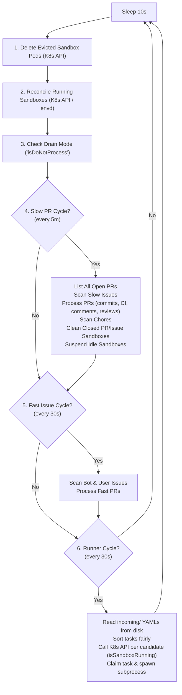

# Factory Watch: Subcontroller Architecture & Asynchronous Orchestration

| Metadata | Details |
| :--- | :--- |
| **Status** | Implemented |
| **Author(s)** | Sam Dowell (`sdowell@google.com`) |
| **Created** | 2026-08-31 |
| **Last Updated** | 2026-09-17 |

This document proposes a decoupled, asynchronous subcontroller architecture for the `factory watch` command. It details the motivation, structural design, shared memory model, concurrency controls, lifecycle management, and a gradual implementation plan.

---

## 1. Overview & Goals

The `factory watch` daemon serves as the central background orchestration engine for the AI Factory. It continuously monitors GitHub repository activity (issues, pull requests, review comments, CI check failures) and scheduled chores, translating them into sandbox execution tasks executed via child `factory` CLI processes.

### Primary Objectives
* **Lower Pickup & Dispatch Latency**:
  * Reduce newly assigned/created issue pickup latency from **O(minutes-hours) down to O(seconds)**.
  * Reduce task scheduling latency to **at most one dispatch interval**, by dispatching from an in-memory queue on a dedicated loop that is never blocked behind scan cycles.
* **Decoupled Separation of Concerns**:
  * Break down the monolithic loop into **5 dedicated, autonomous subcontrollers** running in isolated goroutines coordinated by a shared context.
  * Enforce strict, uni-directional dependencies to prevent circular cross-controller calls.
* **Shared In-Memory State with Disk Write-Through**:
  * Maintain queue state, sandbox leases, and repository metadata in thread-safe memory primitives (`TaskQueueManager`, `SandboxLockRegistry`, `EntityStateCache`).
  * Ensure disk write-through persistence (`incoming/`, `processing/`, `processed/`, `journal.jsonl`) for crash recovery, CLI inspection, and observability.
* **Fault Isolation & Non-Blocking Execution**:
  * Prevent slow GitHub API endpoints (e.g., paginating PR comments or rate limit pauses) or slow Kubernetes API calls (sandbox pod reconciliation, cleanup) from blocking issue scanning or task execution.

---

## 2. Problem Statement & Motivation

### Current Monolithic Architecture
Currently, `Watcher.Run()` executes a single sequential loop governed by a 10-second sleep timer:



### Core Bottlenecks
1. **Head-of-Line Blocking**:
   Evaluating pull requests requires numerous sequential GitHub REST calls (`ListAllCommits`, `ListAllIssueComments`, `ListAllReviews`, `ListAllReviewComments`, `ListAllCheckRuns`, `ListAllStatuses`). If a repository has several active PRs or GitHub experiences latency, PR processing can block the entire thread for 30–60 seconds, halting issue discovery and task dispatching.
2. **Two-Stage Dispatch Lag**:
   An issue created immediately after a fast scan cycle must wait up to 30s for the next scan cycle to be written to `incoming/`, and then another 30s for the runner loop to pick it up, resulting in **60s to 90s+ total delay**.
3. **Repetitive Disk I/O and YAML Deserialization**:
   Every 30-second runner cycle and every HTTP query to `/api/v1/queue` re-reads all files across `incoming/`, `processing/`, and `processed/` directories on disk, parsing each YAML file individually.
4. **Synchronous Kubernetes Status Probing**:
   Candidate queue tasks are verified for sandbox availability via synchronous Kubernetes API queries (`isSandboxTaskRunning`) inside the critical runner loop, causing dispatch delay to scale with queue size and cluster latency.

---

## 3. Proposed Architecture

The daemon will be rearchitected into **5 decoupled subcontroller goroutines** plus an HTTP server, running concurrently under a shared root context. The subcontrollers coordinate entirely through thread-safe in-memory primitives:

```mermaid
flowchart TB
    subgraph External["External Systems"]
        GH["GitHub REST API"]
        K8S["Kubernetes API / Envd"]
    end

    subgraph Controllers["Autonomous Subcontroller Goroutines"]
        ISC["Issue Scanner<br/>(Single Cycle: 30s-60s)"]
        PSC["PR Scanner<br/>(Single Cycle: 1m-2m<br/>+ Worker Pool)"]
        CSC["Chore Scheduler<br/>(Ticker: 30s<br/>+ 5m definition cache)"]
        TQD["Task Dispatcher<br/>(Dedicated Ticker: 30s)"]
        SGC["Sandbox Reconciler & GC<br/>(Ticker: 30s-60s)"]
        SRV["Queue HTTP Server<br/>(:13338 /api/v1/queue)"]
    end

    subgraph SharedMemory["Shared Thread-Safe In-Memory State"]
        TQM["TaskQueueManager<br/>- incoming / processing / processed maps<br/>- fair-share sorter, RWMutex"]
        ESC["EntityStateCache<br/>- open PRs, referenced issues<br/>- open issues, per-half scan marks<br/>- RWMutex"]
        SLR["SandboxLockRegistry<br/>- in-flight sandbox lease table<br/>- Mutex"]
    end

    subgraph Storage["Durable Disk Storage (Write-Through)"]
        FS_INC["queue/incoming/*.yaml"]
        FS_PROC["queue/processing/*.yaml"]
        FS_DONE["queue/processed/*.yaml"]
        FS_JRNL["queue/journal.jsonl"]
    end

    %% Ingestion Flow
    ISC -->|"1. Fetch open issues"| GH
    ISC -->|"2. Check referenced PRs O(1)"| ESC
    ISC -->|"3. Enqueue issue-fix"| TQM

    PSC -->|"1. Fetch PRs, reviews, CI"| GH
    PSC -->|"2. Update open PRs & metadata"| ESC
    PSC -->|"3. Enqueue pr-tasks"| TQM

    CSC -->|"1. Read .agents/ cron"| GH
    CSC -->|"2. Enqueue agent-chore"| TQM

    %% Persistence
    TQM -->|"Atomic write"| FS_INC

    %% Dispatcher Flow
    TQD -->|"1. Poll for ready tasks"| TQM
    TQD -->|"2. Acquire sandbox lease"| SLR
    TQD -->|"3. Claim task (incoming to processing)"| TQM
    TQM -->|"Atomic rename"| FS_PROC

    TQD -->|"4. Spawn worker goroutine"| WKR["Worker Goroutine<br/>(factory CLI)"]
    WKR -->|"Executes in cluster sandbox"| K8S
    WKR -->|"5. Release lease"| SLR
    WKR -->|"6. Mark completed / failed"| TQM
    TQM -->|"Atomic rename"| FS_DONE
    TQM -->|"Append event"| FS_JRNL

    %% Reconciliation Flow
    SGC -->|"1. Check pod states & envd status"| K8S
    SGC -->|"2. Fast-path check open status"| ESC
    SGC -->|"3. Clean up closed sandboxes"| K8S

    %% HTTP API
    SRV -->|"In-memory RLock query"| TQM
```



---

## 4. Subcontroller Design & Separation of Concerns

To guarantee maintainability and eliminate circular dependencies, subcontrollers must have strictly defined boundaries and communicate only via shared memory primitives and Go channels.

### 1. `IssueScanner`
* **Location**: Dedicated `watch/issues` package, built via `issues.New(Config, Deps)`. It reaches the daemon through four narrow collaborators — a `Queue` (`TaskExists` / `Enqueue` / `RemovePendingTasksForNumber` / `GetProcessedTask` / `ListProcessedTasks`), an `Entities` view of `EntityStateCache`, a `Sandboxes` probe, and a `UserSelector` — plus a GitHub client for its own queries. Role-based bot selection stays with the `Watcher` behind `UserSelector`, because it reads the factory config and can pin a task to the account an existing sandbox already belongs to.
* **Cadence**: Two intervals, split along the same line as the other subcontrollers — what is cheap runs often, what paginates does not:
  * `Interval` (default **30s**) scans the issues that are the watcher's business by ownership: those assigned to a bot in the pool, and those the operator filed themselves. Each is a single page sorted by update time, which is what makes it cheap enough to run at this cadence, and it is what sets pickup latency for a new issue.
  * `SweepInterval` (default **5m**) paginates over every trigger-labelled issue and publishes the open-issue set to `EntityStateCache`. This is the expensive half; running it on the fast ticker would multiply its GitHub traffic tenfold to discover the same issues the fast queries already surface while they are being worked on. It also fires on the first cycle, so a restart does not wait out a full sweep interval.
  * The original single-ticker prescription (30–60s for everything) predates that split. An issue that falls off the first page of the fast queries has not been touched recently, and is picked up by the sweep.
* **Responsibilities**:
  * Scans open issues assigned to bot accounts or created by the user login (automatically labeling and assigning newly created user issues) and issues carrying the trigger label (e.g., `factory`).
  * Filters out items that are pull requests (`item.PullRequestLinks != nil`).
  * Consults `EntityStateCache.GetReferencedIssuesMap()` for instant O(1) in-memory checks rather than calling the GitHub Timeline API, and falls back to the Timeline and Search APIs only for the issues that survive it.
  * Probes `SandboxService.IsTaskRunning(sandboxName)` to avoid duplicate work if a sandbox is currently active.
  * Uses `TaskQueueManager.TaskExists(filename)` as the authoritative in-memory check before falling back to disk, and withdraws the pending tasks of an issue that has since been stopped.
  * Keeps its own record of when each issue was last worked on, recovered on first use from `Queue.ListProcessedTasks()` rather than by reading `processed/`. It is a plain map with no mutex, because `ScanOnce` is only ever called from the `Run` loop or from the caller itself in `--once` mode. The per-workflow cooldown is answered the same way, from `Queue.GetProcessedTask(filename)`.
  * Enqueues `issue-fix` (or `agent-chore` if the issue specifies an `.agents/` workflow) directly into `TaskQueueManager`.
* **Cold Cache Guard**: An unpopulated open PR cache is indistinguishable from "no open PR references this issue", so a scan that trusted it would re-trigger fixes for issues that already have one — which is exactly what happened after a restart into a rate limit window. The scanner fails closed on `HasOpenPRs()`. Because the two scanners are gated independently and a deployment can scan issues with pull request scanning switched off, the issue scanner primes that half of the cache itself with a single listing when — and only when — no pull request scanner is running to fill it. It is not a fallback for a cache the owner has simply not reached yet: priming on cold alone would duplicate the listing on every start and give the cache two writers.
* **Pause Signal**: `Deps.Paused` is the same read-only drain signal the reconciler and chore scheduler take. Queueing a fix is taking on new work, which is precisely what a drain stops.
* **Decoupling Guarantee**: Does **not** invoke `PRScanner.ProcessPRs`. Pull requests returned in GitHub API issue queries are dropped: the pull request scanner lists them itself on its own cadence, which keeps the dependency graph acyclic without a handoff channel or a shared primitive to carry it.


### 2. `PRScanner`
Implemented as `watch/prs.Scanner` (`New(Config, Deps)` / `Run(ctx)` / `ScanOnce(ctx)`).

* **Cadence**: Two intervals rather than the single ticker this document originally specified, for the same reason the reconciler, the chore scheduler and the issue scanner ended up with two:
  * **1m fast pass** over the pull requests currently assigned to the bot pool — one single-page query per bot account. Assignment is how a pull request is claimed, so this is exactly the set with work in flight, and therefore the set whose CI results, review feedback and merge state change between sweeps.
  * **5m sweep** over every pull request the watcher is responsible for (assigned *or* trigger-labelled, both fully paginated), which also refreshes the open PR half of `EntityStateCache`.
  * The two are **alternatives within a cycle**, not additions: the sweep's candidate set is a superset of the fast pass's, so running both would evaluate the assigned pull requests twice. A single 1m ticker over the full set was rejected because evaluating one pull request costs the better part of a dozen GitHub requests; at that cadence a busy repository would exhaust its hourly rate limit.
* **Concurrency**: A bounded worker pool over the cycle's candidates, so one pull request whose comment history takes ten seconds to page does not delay the rest. The bound is configurable; what matters is that it exists, since an unbounded pool would turn a large sweep into a burst of concurrent GitHub traffic. Candidates are deduplicated by number, which guarantees each pull request is handled by at most one worker per cycle.
* **Responsibilities**:
  * Publishes the open PR list to `EntityStateCache` on each sweep, from which the issue scanner learns which issues already have a fix in flight and the sandbox reconciler learns which sandboxes are still wanted. A failed listing leaves the previous copy in place rather than publishing a partial one as complete.
  * Fetches each pull request's conversation once per evaluation (`prHistory`: commits, comments, reviews, inline review comments) so that every phase reasons about the same snapshot.
  * Inherits labels from the issues a pull request closes, then re-checks the stop label — the sync itself may have applied it.
  * **Adopts orphaned bot pull requests** at the top of each sweep, before the candidate listing. The candidate set is "assigned *or* trigger-labelled", so a pull request with neither is invisible — and the label inheritance above, which would have fixed that, runs inside the evaluation it never gets. That is not hypothetical: a watch cycle that recycles while a fix task is running kills the `factory fix` process that would have labelled the resulting pull request, while the task itself keeps going detached and opens one anyway. The pass runs over the open PR list the sweep has already fetched, so finding the orphans is free, and it runs before the listing so that a pull request adopted in a cycle is also evaluated in it. Adoption is gated on the parent issue carrying the trigger label: a bot account also opens pull requests that are none of the watcher's business, and from here they are indistinguishable from a fix except by what the repository has already said about the issue behind them.
  * Pauses a pull request no human has engaged with for `PRInactivityTimeout`, applying the stop label and posting the explanation once.
  * Uses `Sandboxes.IsTaskRunning` and `TaskQueueManager.TaskExists` / `HasActivePRTask` as the authoritative in-memory checks, rather than racy disk directory scans during task renames.
  * Evaluates PR state across four **ordered** phases. The order is the design, not an implementation detail: unaddressed feedback wins over everything, because a human asking for a change makes the conflict or CI failure the agent would otherwise chase irrelevant.
    1. **Review Feedback & Comments**: unaddressed human comments and bot reviews (`pr-comments`), acknowledged with `eyes` reactions. A failed attempt is retried up to three times against the same head, **10 minutes apart** — the agent dying partway through says nothing about the feedback, and without the retry a single sandbox failure dropped it. A retry sets aside the `eyes` mark the attempt being retried wrote, which is what makes each attempt work from the same set of comments; the addressed-at stamp needs no such treatment, since a failed attempt never writes one. The run ends on a success, a new commit, or a human comment since the last failure; the third failure is the one that marks the comments `confused` and says so on the pull request. No stop label goes with it, unlike the investigation breaker below: the feedback is parked, the pull request is not.
    2. **Conflicts / Rebase**: gated on mergeability (`pr-iterate`) — nothing can be verified until the branch merges.
    3. **CI Gating & Investigation**: check runs and commit statuses (`pr-investigate`), with a three-attempt circuit breaker that resets on a new commit or a human comment.
    4. **Automated Code Review**: opt-in by label (`pr-review`), strictly gated on `!hasPending && !hasFailure`.
  * **Deterministic Ready-for-Human Reconciler**: gated on clean CI, addressed comments, completed reviews and no active task (`!HasActivePRTask`, read from memory so the label does not flap while a task file is renamed between directories). Runs in both directions — removing the label matters as much as adding it — and unassigns the bot on qualification.
  * Enqueues tasks directly into `TaskQueueManager`.
* **State ownership**: the `lastReviewedSHA` / `lastCommentAddressedSHA` / `lastInvestigatedSHA` / `lastIteratedSHA` gating record lives in a mutex-guarded `stateStore` **inside the package**, not on `EntityStateCache` as §5C originally proposed. Nothing outside this scanner reads it, and the shared cache is for state that crosses subcontroller boundaries; putting single-owner bookkeeping there would make it look shared when it is not. The mutex is what the worker pool requires, and it is cheaper than a shared primitive. The store recovers itself on first use by folding `Queue.ListProcessedTasks()`, and the "did the last investigation fail, so is this revision worth another attempt?" check reads `Queue.GetProcessedTask(filename)`; neither opens a task file. The scanner is its only writer bar one: `lastCommentAddressedTime` is written by the task coordinator when a `pr-comments` task finishes successfully (`PRScanner.NoteFeedbackOutcome`), from the dispatcher's goroutine, which is why the store exposes a locked read-modify-write rather than a `get` / `set` pair.
  * The **address-feedback attempt count is the exception**: it is persisted on the task itself (`QueueTask.Attempt`) and read back through `Queue.GetProcessedTask`, not held in the store. The store deliberately folds a failed task in as nothing — recording it would suppress the very retry it is evidence for — so a counter kept there would reset on every restart, which is exactly when a pull request stuck in a failing loop is most likely to be handed a budget it has not earned.
* **Decoupling Guarantee**: Does **not** scan issues or chores. Issue-typed items returned by its queries are dropped.

### 3. `ChoreScheduler`
* **Location**: Dedicated `watch/chores` package, built via `chores.New(Config, Deps)`. It reaches the rest of the daemon through two narrow collaborators and therefore depends on neither GitHub nor the cluster directly:
  * `chores.Source` — lists and reads the agent definitions under `.agents/`, in paths and raw contents only. The GitHub-backed implementation is the `watcherAgentSource` adapter in the `watch` package.
  * `chores.Queue` — the `TaskExists` / `Enqueue` pair, which is all the scheduler needs and is all it is permitted: it adds chore tasks and can mutate nothing else. `TaskQueueManager` satisfies it directly.
* **Cadence**: Two intervals, split along the line between what is cheap and what is not:
  * `Interval` (default **30s**) drives `ScheduleOnce`, which compares each cached schedule against the recorded last run. This is pure in-memory arithmetic, so it can run far more often than the definitions are fetched — and it is what sets the precision with which a chore fires once due.
  * `RefreshInterval` (default **5m**) bounds how long a fetched set of definitions is reused. Reading them costs one request to list `.agents/` plus one per definition, which is the only part of scheduling that touches the network. Fetching them every evaluation cycle would multiply that traffic tenfold to learn nothing: definitions change when someone edits the repository, not when a chore comes due.
  * A failed refresh keeps serving the previous copy. Schedules are evaluated against that copy without any network call, so a GitHub outage delays picking up *edits* to `.agents/` rather than stopping chores from firing.
* **Responsibilities**:
  * Parses schedules out of the `.agents/` definitions' frontmatter, ignoring agents that declare none — those are invoked by issues, not by a clock. A definition that cannot be read or parsed is reported and skipped, so one malformed file cannot take the remaining chores down with it.
  * Computes the next execution with `cron.Parse(schedule).Next(lastRun)`, treating `never` and `paused` as disabled and a chore that has never run as immediately due. An unparsable expression falls back to a 24h interval with a warning, rather than silently disabling the chore on a typo.
  * Uses `TaskQueueManager.TaskExists(filename)` as the in-memory deduplication: a chore still queued or running from an earlier cycle is skipped outright, since the queue is keyed by file name and a second copy could not be distinguished from the first.
  * Tracks execution history in `chores_state.json` under the queue directory, read once on first use and served from memory afterwards — the scheduler is that file's only writer. Writes go through a temporary file and a rename: a crash mid-write would otherwise leave a truncated file that reads back as "no chore has ever run" and re-fires every chore. A run is recorded only once the enqueue succeeded.
  * Enqueues `agent-chore` tasks directly into `TaskQueueManager`.
* **Pause Signal**: `Deps.Paused` is the same read-only drain signal the `SandboxReconciler` takes, supplied by `Watcher.draining`. Draining is how an operator stops the daemon from taking on new work, and a chore queued during a drain is exactly that. As with the reconciler, shutdown does *not* travel through it: the scheduler runs under the daemon context, and cancelling that also aborts a cycle already in flight.
* **Single-Goroutine by Construction**: The definition cache and the run state are plain fields with no mutex, because `ScheduleOnce` is only ever called from the `Run` loop, or from the caller itself in `--once` mode. Nothing else may call into the scheduler concurrently.
* **Decoupling Guarantee**: Completely independent of PR and issue scanning cycles. Chores previously rode inside the *slow PR cycle* of `checkRepo`, which meant a chore came due up to 5 minutes before anything noticed, and any GitHub latency in PR evaluation delayed it further.

### 4. `TaskDispatcher` (Core Execution Engine)
* **Location**: Dedicated `watch/dispatcher` package, so the execution path cannot reach into scanner internals.
* **Cadence**: Single dedicated ticker (`Config.Interval`, default **30 seconds**), running in its own goroutine so dispatch is never blocked behind scan or reconcile cycles.
* **Responsibilities**:
  * Evaluates drain state (`TaskQueueManager.IsDrainMode()`) and active execution bounds (`MaxPending`, `MaxActions`).
  * Consults `TaskQueueManager.ClaimNextEligibleTask(predicate)`:
    ```go
    // Predicate MUST be a pure, non-blocking in-memory check.
    // NEVER perform network calls (GitHub/K8s) or call mutating TaskQueueManager methods inside predicate!
    isAvailable := func(filename string, task *QueueTask) bool {
        sandboxName := resolveSandboxNameFast(task.Type, task.Number)
        return !sandboxLocks.IsBusy(sandboxName)
    }
    ```
  * Task claim and lease acquisition flow:
    1. Atomically claims candidate task in memory (`incoming` $\rightarrow$ `processing`) and moves disk file (`incoming/` $\rightarrow$ `processing/`).
    2. Atomically acquires lease in `SandboxLockRegistry` via `sandboxLocks.TryAcquire(sandboxName, filename)`. If acquisition fails, reverts task back to `incoming` via `RequeueTask`.
    3. Performs post-claim validation outside the queue lock: checks stop labels (`overseer/stop`), closed state, and completed recovery status. If invalidated, marks completed/cancelled outside the lock without deadlocking.
  * Spawns an asynchronous worker goroutine that delegates execution to a `TaskRunner`. The production implementation, `CLIRunner`, is the only component that maps a task onto a child `factory` CLI command line.
  * Worker completion handling (success, failure, or timeout):
    1. Calls `TaskQueueManager.CompleteTask` or `TaskQueueManager.FailTask`.
    2. Atomically moves disk file from `processing/` $\rightarrow$ `processed/`.
    3. Appends structured entry to `journal.jsonl`.
    4. Releases lease in `SandboxLockRegistry` verifying task ownership: `sandboxLocks.Release(sandboxName, filename)`.

### 5. `SandboxReconciler`
* **Location**: Dedicated `watch/sandbox` package. It exposes two collaborators so that the cheap per-task lookups and the expensive sweeps are not entangled:
  * `sandbox.Service` — point lookups and probes (`ResolveName`, `IsTaskRunning`, `IsTaskCompleted`, `CountRunningTasks`, `Delete`) shared by the scanners and the dispatcher. It is the only place that knows how a task number maps onto a sandbox name.
  * `sandbox.Reconciler` — the autonomous goroutine, built via `sandbox.New(Config, Deps)`.
* **Cadence**: Two independent tickers driven from a single `select` loop, because the two workloads have very different costs:
  * `Interval` (default **30s**) drives `ReconcileOnce`: deleting evicted pods and refreshing the recorded task state of sandboxes that still claim to be running. These are namespace-scoped cluster calls with a fixed cost.
  * `GCInterval` (default **5m**) drives `CollectGarbage`. Collection confirms every candidate against GitHub before deleting it, so its cost scales with the number of sandboxes whose entity is missing from the cache. Running it on the fast ticker would multiply GitHub API traffic by 10x for no latency benefit, since nothing waits on garbage collection.
  * Both cycles also run once at startup, so a daemon that is restarted more often than `GCInterval` still collects. Because the two share a goroutine, a slow sweep of either kind postpones the other until it returns; that is accepted deliberately in favour of a loop with no timeout plumbing or lifecycle of its own.
* **Responsibilities**:
  * Proactively deletes evicted sandbox pods (`Phase == Failed`, `Reason == Evicted`) and increments eviction counts. The sandbox name can live under either the `sandbox` or the `agents.x-k8s.io/sandbox` label, and a label selector cannot express "has either key", so each key is listed in turn and the results merged. The pod delete arbitrates the eviction count: `Service.IsTaskRunning` cleans up evicted pods too, so only whoever wins the delete increments the counter and the loser sees `NotFound`.
  * Reconciles running sandbox pods (checks container exit codes and `envd` status, updates annotations) via `Service.RefreshTaskState`, which is `IsTaskRunning` under the name that admits the annotation correction is the point and the boolean incidental.
  * Cleans up sandboxes belonging to closed/merged PRs and closed issues (using `EntityStateCache` to fast-path open entities without GitHub API calls).
  * **Lease-Protected Operations**: The reconciler *takes* `sandboxLocks.TryAcquire(sandboxName, "sandbox-gc")` for the whole confirm-and-delete, rather than testing `IsBusy` and then acting. Testing is not enough: confirming an entity against GitHub or probing a sandbox takes long enough that the dispatcher could lease the sandbox and start a task in the gap, and the delete would then destroy the workspace that task is running in. Holding the lease makes the dispatcher's `TryAcquire` fail instead, so it simply retries on a later cycle. This covers closed PR/issue collection, stale eviction and idle suspension.
  * Suspends idle sandboxes by walking the sweep's own listing and calling `factorysandbox.SuspendSandboxIfIdle` per sandbox, each bracketed by the same acquire/release as every other pass, so a lease is never held across more than one sandbox. Sandboxes already deleted earlier in the sweep are skipped. Because the listing can be minutes old by the time a given sandbox is reached, `SuspendSandboxIfIdle` re-reads the sandbox before writing: the stale copy would carry a stale `resourceVersion`, and the re-read is also the last chance to notice the sandbox picked up work in the meantime.
  * Harvests token usage via `usagereport.HarvestSandbox`.
* **Cold Cache Guard**: An unpopulated cache is indistinguishable from "every entity is closed" on the fast path, so before the first scan the reconciler would confirm every sandbox against GitHub one at a time. The two halves of `EntityStateCache` are filled by *different* scans, so they are gated separately — `HasOpenPRs()` guards closed-PR collection and `HasOpenIssues()` guards closed-issue collection. Gating both on the PR signal, the first cut of this design, meant a mode that never ran a PR scan silently lost the issue fast path. Eviction and suspension read nothing but cluster state, so they are not gated at all and stay useful in modes where no scanner ever runs.
* **Pause Signal**: `Deps.Paused` lets the `Watcher` hold off reclamation while the queue is draining, which `checkRepo` used to get for free when collection lived inside it. It is deliberately a `func() bool` rather than a queue handle: the reconciler can observe that the queue is draining but has no way to mutate it. State reconciliation keeps running while paused — it is non-destructive, and the drain report counts running tasks from exactly the annotations it corrects.
* **Drain and Shutdown Are Not the Same Signal**: Shutdown deliberately does *not* travel through `Paused`. The reconciler runs under the daemon context, so `daemonCancel()` already stops it, and cancellation additionally aborts a sweep that has already started — `Paused` is read once at the top of `CollectGarbage` and cannot. Drain in turn cannot be expressed as cancellation: it is a marker file an operator removes to resume, whereas a cancelled context never comes back, so a drain that cancelled the reconciler would leave the daemon permanently without GC, eviction and suspension. Cancelling on drain would also take `ReconcileOnce` down with it, which is precisely what must keep running: it is the only thing correcting the `last-task-state` annotations that the drain report counts, so the "active child sandboxes" readout would never converge to zero.
* **Decoupling Benefit**: Removes all heavy cluster operations from the critical scanning and task dispatching paths. The reconciler observes queue state exclusively through `SandboxLockRegistry` and the read-only `Paused` signal, so it has no dependency on `TaskQueueManager`.

### 6. `QueueServer` (HTTP API)
* **Port**: `:13338`
* **Responsibilities**:
  * Serves `GET /api/v1/queue` directly from in-memory state via `TaskQueueManager.GetQueueResponse()` under an `RLock()` in **< 1ms**.
  * Handles queue mutation endpoints (`DELETE /queue/:task`, `POST /queue/:task/priority`) by updating in-memory state and persisting to disk.

---

## 5. Shared Memory Model & Concurrency Primitives

### A. `TaskQueueManager` (In-Memory Queue with Write-Through Disk Persistence)

```go
type TaskQueueManager struct {
    mu          sync.RWMutex
    incoming    map[string]*QueueTask // Key: filename
    processing  map[string]*QueueTask
    processed   map[string]*QueueTask

    incomingDir      string
    processingDir    string
    processedDir     string
    processingLogDir string
    processedLogDir  string
    queueDir         string
    dryRun           bool
}
```

* **Thread-Safety**: All reads and writes to `incoming`, `processing`, and `processed` maps are guarded by `mu`.
* **Sole Owner of Task Files**: The `TaskQueueManager` is the only component that opens a task file. Subcontrollers (`PRScanner`, `IssueScanner`, `ChoreScheduler`) MUST reach task state through it rather than reading the queue directories:
  * `TaskExists(filename)` and `HasActivePRTask(num)` for work that is queued or running, which eliminates race conditions during atomic file renames.
  * `GetProcessedTask(filename)` and `ListProcessedTasks()` for work that has finished. The scanners recover their gating state — when an issue was last worked on, and which commit of a pull request was last reviewed, investigated or rebased — from these rather than walking `processedDir`. Going through the queue also hands them the tasks that finished *since* start-up, which a one-shot directory read missed.
  * Both accessors return copies. A caller that could mutate what it read back would be editing queue state without the queue knowing.
* **Directory Ownership**: `EnsureDirs()` creates the five directories the queue stores tasks and task logs in. The queue creates them because it owns them; callers do not lay out queue storage.
* **Drain Awareness**: `IsDrainMode()` reports whether processing is paused (drain marker files in `queueDir` or drain environment variables), giving the dispatcher and the watcher a single source of truth.
* **Atomic Write-Through**:
  * `Enqueue()`:
    1. Verifies deduplication in memory (`incoming` and `processing` maps).
    2. Writes task file atomically to `incomingDir` using temporary file + rename (`writeTaskAtomically`).
    3. Adds task to `incoming` map.
    4. Appends `Created` event to `journal.jsonl`.
  * `ClaimNextEligibleTask()`:
    1. Sorts `incoming` map in memory using fair-share prioritization (`sortTasksFairly`).
    2. Iterates over candidates and tests caller's availability predicate (`isAvailable(task)`).
    3. Predicate execution MUST NOT make network calls or call mutating `TaskQueueManager` methods.
    4. Moves file on disk from `incomingDir` $\rightarrow$ `processingDir`.
    5. Sets `task.Status = "Running"`, moves from `incoming` to `processing` map, records `Started` in journal.
  * `CompleteTask()` / `FailTask()`:
    1. Updates task status and completion timestamp in memory.
    2. Renames disk file from `processingDir` $\rightarrow$ `processedDir`.
    3. Moves corresponding `.log` file from `processingLogDir` $\rightarrow$ `processedLogDir`.
    4. Records `Completed` or `Failed` in `journal.jsonl`.
* **Recovery on Startup**: `LoadFromDisk()` populates in-memory maps from disk on daemon initialization. A recovered task in `processedDir` that carries no `completedAt` is dated by its file's modification time, so that readers of the processed set never have to stat the file themselves.

### B. `SandboxLockRegistry` (In-Memory Leases)

```go
type SandboxLockRegistry struct {
    mu     sync.Mutex
    leases map[string]string // sandboxName -> taskFilename
}
```

* **Operations**:
  * `TryAcquire(sandboxName, taskFilename string) bool`: Atomically acquires lease if not already held. Returns false if already leased.
  * `Release(sandboxName, taskFilename string) bool`: Scoped release that only clears the lease if held by `taskFilename`, preventing lease hijacking if another worker exits.
  * `IsBusy(sandboxName string) bool`: O(1) check used by the dispatcher predicate and reconciler guards.

### C. `EntityStateCache` (Thread-Safe Metadata Cache)

```go
type EntityStateCache struct {
    mu               sync.RWMutex
    openPRs          []*githubv39.PullRequest
    referencedIssues map[int]bool
    openIssues       map[int]bool
    lastPRScan       time.Time
    lastIssueScan    time.Time
}
```

* **Purpose**:
  * Serves as the single authoritative thread-safe cache for open PR and issue state across subcontrollers.
  * Eliminates unsynchronized local map writes in `PRScanner` and `IssueScanner`.
  * Allows `IssueScanner` to check `IsIssueReferenced(num)` in O(1) time without API calls.
  * Allows `SandboxReconciler` to fast-path open PR and open issue checks during sandbox GC.
* **A Miss Is Always Safe**: Consumers treat the cache as a fast path and fall back to GitHub, which stays authoritative. What is *not* safe is reading an unpopulated cache as "nothing is open", so `lastPRScan` and `lastIssueScan` record whether each half has been published to. `HasOpenPRs()` and `HasOpenIssues()` distinguish "scanned, found nothing" from "never scanned" — only the latter means the corresponding fast path cannot be trusted. Scanners publish only on success, since a failed paginated scan returns a partial list that would otherwise be cached as though it were complete.
* **Resolved: Per-Entity Processed State stays with its owner**. This document originally planned to move `processedPRs` (the `lastReviewedSHA` / `lastCommentAddressedSHA` / `lastInvestigatedSHA` / `lastIteratedSHA` gating state) here in step 3d, on the grounds that the PR scanner evaluates pull requests on a worker pool. It did not land here, and neither did `processedIssues`. The deciding question turned out to be *who reads it*, not *how many goroutines write it*: nothing outside the PR scanner reads which commit a pull request was last reviewed at, and nothing outside the issue scanner reads when an issue was last worked on. Each keeps its own record — the issue scanner as a plain map, since it is single-goroutine; the PR scanner as a mutex-guarded `stateStore`, which is all the worker pool actually needs. Putting single-owner bookkeeping in a cache named *shared* would have advertised a coupling that does not exist. What belongs here is the state that genuinely crosses subcontrollers: the open pull requests, which the issue scanner reads to tell that an issue already has a fix in flight, and the reconciler reads to tell that a sandbox is still wanted.

---

## 6. Lifecycle, Concurrency & Shutdown

### Startup & Initialization Flow
1. **Load Config & Secret**: Initialize GitHub and Kubernetes clients, resolve target bot identities.
2. **Directory Verification**: Create `incoming`, `processing`, `processed`, and `logs` directories if they do not exist.
3. **Queue Rehydration**: `TaskQueueManager.LoadFromDisk()` seeds in-memory maps from existing YAMLs.
4. **Crash Recovery & Task Adoption**: Run `TaskDispatcher.Recover(ctx)` to reconcile tasks found in `processing/`. Active pod runs are adopted by supervisor goroutines owned by the dispatcher.
5. **Start HTTP Server**: Launch queue server listening on `:13338`.

### Startup Crash Recovery & Running Task Adoption

Because task execution inside cluster sandboxes is detached (`nohup ... &` via `envd`), a task may still be actively running inside a sandbox container even if the `factory watch` host process crashed or restarted. In the previous architecture, tasks found running during startup were simply left in `processing/` without any supervisor, causing them to become permanently orphaned.

Recovery is owned by the `TaskDispatcher`, which already owns sandbox leases and task execution. It handles tasks in `processing/` across restarts using a deterministic three-way recovery flow:

```mermaid
sequenceDiagram
    participant TQD as TaskDispatcher.Recover
    participant TQM as TaskQueueManager
    participant SLR as SandboxLockRegistry
    participant Mon as Adoption Monitor Goroutine
    participant Pod as Cluster Sandbox (envd)

    Note over TQD: Watcher restarts, finds task-*.yaml in processing/
    TQD->>TQM: SyncProcessingFromDisk() / ProcessingTasks()
    TQD->>Pod: Probe IsTaskRunning()

    alt State A: Pod already completed before restart
        TQD->>TQM: CompleteTask() (move to processed/)
    else State B: Pod failed / evicted / missing
        TQD->>TQM: Re-queue to incoming/ with Recovered=true
    else State C: Pod is still actively executing
        TQD->>SLR: TryAcquire(sandboxName, filename) (Reserve Lease)
        TQD->>Mon: Spawn monitorAdoptedTask(ctx, task, sandboxName)
        Note over TQD: Recover returns; subcontrollers keep starting...

        loop Poll Status (AdoptionPollInterval)
            Mon->>Pod: Check envd exit_code file / pod status
            Pod-->>Mon: Still running
        end

        Pod-->>Mon: Task finished! (Exit code 0 or != 0)
        Mon->>TQM: CompleteTask() / FailTask()
        Note over TQM: Moves processing/ -> processed/ on disk & memory
        Mon->>SLR: Release(sandboxName)
        Mon->>Mon: Notify coordinator (comment reactions) & write journal
    end
```

#### Detailed Recovery States:
1. **Tri-State Evaluation**: For every task found in `TaskQueueManager.processing`, the dispatcher probes the resolved sandbox exactly once:
   * **State A (Already Finished)**: If `IsTaskCompleted(sandboxName)` is true, the dispatcher calls `TaskQueueManager.CompleteTask(filename, task)`, atomically moving the task file and logs to `processed/` and writing a journal event. No lease is taken.
   * **State B (Terminated / Evicted / Missing)**: `task.Recovered = true` is set and the task is moved back to `incoming/` via `TaskQueueManager.Enqueue` so the dispatcher can re-schedule it. No lease is taken.
   * **State C (Still Actively Running — Adoption)**: The sandbox lease is acquired (`sandboxLocks.TryAcquire`), guaranteeing that neither the dispatcher nor the scanners can target that sandbox, the task remains in `TaskQueueManager.processing`, and an **Adoption Monitor Goroutine** is spawned under the dispatcher's worker WaitGroup.
2. **Unparsable Files**: Task files in `processing/` that cannot be parsed are returned to `incoming/` by `TaskQueueManager.RequeueUntrackedProcessingFiles()` instead of being orphaned.

#### Adoption Monitor Goroutine (`monitorAdoptedTask`):
* **Budget Tracking**: Computes the remaining timeout from the task's `StartedAt`/`EnqueuedAt`/`CreatedAt` so a restart does not grant a fresh full timeout.
* **Status Polling**: Every `Config.AdoptionPollInterval` (default 5s), probes the sandbox via `SandboxService`.
* **Post-Completion Execution**:
  * On success: calls `TaskQueueManager.CompleteTask()` and `TaskCoordinator.NotifyTaskFinished(ctx, task, nil)`, which resolves `pr-comments` reactions with `+1`.
  * On failure: calls `TaskQueueManager.FailTask()` and notifies with an error. For `pr-comments` the reactions are resolved with `confused` only once the attempt budget is spent — reactions can be added but never removed, so a mark written between attempts would permanently claim the watcher gave up on feedback it is about to retry.
  * On timeout: force deletes the sandbox, then fails the task.
  * Atomically renames YAML and `.log` files to `processed/` and appends a structured entry to `journal.jsonl`.
  * Releases the sandbox lease when the goroutine exits.
* **Reconciliation Safety Net** (*not yet implemented*): A task can be orphaned if its monitor goroutine dies without recording an outcome. The sweep that detects this must compare `TaskQueueManager.processing` against sandbox state and transition finished tasks to `processed/`. It belongs to the `TaskDispatcher`, which already owns task lifecycle, leases and adoption monitors — **not** to `SandboxReconciler`, which is deliberately free of any `TaskQueueManager` dependency so that cluster garbage collection can never mutate queue state.

### Subcontroller Coordination & Lifecycle Management
Subcontrollers run under a shared cancelable context (`daemonCtx`). Each subcontroller owns the synchronization primitives for the **workers it spawns**; the `Watcher` never tracks another subcontroller's workers.

* **Subcontroller-Owned Worker WaitGroups**:
  * Each subcontroller that spawns goroutines declares a private `wg sync.WaitGroup` covering only the ones it starts. For `TaskDispatcher` this is both task workers (`executeTask`) and adopted-task monitors (`monitorAdoptedTask`). `SandboxReconciler` spawns none — its whole `Run` is one loop on the caller's goroutine — so it needs no WaitGroup at all.
  * `Run(ctx)` drains its own goroutines via `wg.Wait()`, so returning from `Run` is itself the signal that the subcontroller is fully quiesced. The `Watcher` only has to wait for `Run` to return.
  * The `Watcher` exposes `Wait()`, which delegates to the subcontrollers' `Wait()` methods. This is used by `--once` mode, where no polling loop is started but workers may still be in flight.
  * *Rationale*: Mixing long-running controller loops and short-running tasks on a single shared WaitGroup causes `Wait()` to block indefinitely or triggers runtime panics if `Add()` is invoked concurrently with `Wait()`. Scoping each WaitGroup to its owning subcontroller makes the `Add()`/`Wait()` pairing local and auditable.
* **Clean Stop Is Not An Error**: A subcontroller's `Run` returns `nil` once cancellation has drained it. Cancellation is how these loops are *asked* to stop, so reporting `ctx.Err()` would force every call site to distinguish an expected shutdown from a real failure, and would make a future `errgroup` wiring treat shutdown as the first error.
* **Watcher-Owned Join WaitGroup**: `Watcher.Run` uses a *local* `sync.WaitGroup` purely to join the subcontroller `Run` goroutines it launched. Its `Add` calls all happen before any `Wait`, and it never tracks task workers, so it does not reintroduce the failure mode above. A plain WaitGroup is preferred over `errgroup` because there is no error worth propagating and `errgroup` would cancel siblings on the first return during a shutdown that is already underway.

```go
func (w *Watcher) Run(ctx context.Context) error {
    if err := w.init(ctx); err != nil {
        return err
    }

    if w.Once {
        w.reconciler.ReconcileOnce(ctx)
        w.checkRepo(ctx)
        w.reconciler.CollectGarbage(ctx) // after the scan, so the entity cache is warm
        w.dispatcher.DispatchOnce(ctx)
        w.Wait() // delegates to each subcontroller's own Wait()
        return nil
    }

    daemonCtx, daemonCancel := context.WithCancel(ctx)
    defer daemonCancel()

    // Each subcontroller's Run() drains its own workers before returning.
    var wg sync.WaitGroup
    for _, run := range []func(context.Context) error{w.reconciler.Run, w.dispatcher.Run} {
        wg.Add(1)
        go func() { defer wg.Done(); _ = run(daemonCtx) }()
    }

    doneChan := make(chan struct{})
    go func() { defer close(doneChan); wg.Wait() }()

    for {
        select {
        case <-ctx.Done():
            return ctx.Err()
        case <-w.timeoutChan:
            daemonCancel()
            select {
            case <-doneChan: // all subcontrollers quiesced
            case <-time.After(5 * time.Minute):
            }
            return nil
        case <-time.After(pollInterval):
            w.checkRepo(ctx)
        }
    }
}
```

### Graceful Shutdown & Drain Handling
* When `ctx.Done()` is received or `WatchTimeout` expires:
  1. `daemonCancel()` cancels `daemonCtx`, signaling all subcontrollers to exit their polling `select` loops cleanly.
  2. `TaskDispatcher` stops claiming new tasks from `incoming`.
  3. Each subcontroller's `Run` blocks on its own `defer wg.Wait()`, letting active workers and adopted-task monitors finish before returning.
  4. The `Watcher` waits for every subcontroller's `Run` to return, bounded by a 5-minute maximum drain timeout.
* When drain mode (`TaskQueueManager.IsDrainMode()`, backed by the `DO_NOT_PROCESS` marker in the queue directory) is active:
  1. The `TaskDispatcher` stops claiming new tasks.
  2. Active in-flight tasks continue running until completion.

### Concurrency Invariants & Safeguards

To prevent race conditions, deadlocks, and state divergence in this asynchronous design:

1. **Non-Reentrant, Non-Blocking Predicates**:
   `TaskQueueManager.ClaimNextEligibleTask(predicate)` holds the queue write lock (`m.mu.Lock()`). The `predicate` function MUST be a pure in-memory test (e.g. `!sandboxLocks.IsBusy(sbName)`). It MUST NEVER make network calls (GitHub, Kubernetes) and MUST NEVER call mutating `TaskQueueManager` methods (`RemoveTask`, `CompleteTask`) to avoid fatal self-deadlocks and thread starvation.
2. **Scoped Sandbox Leases with Task Ownership**:
   `SandboxLockRegistry.Release(sandboxName, taskFilename)` only releases a lease if `leases[sandboxName] == taskFilename`. This prevents a failing or timed-out worker from inadvertently wiping out a lease owned by another active worker.
3. **Atomic Claim & Lease Acquisition with Fallback Requeue**:
   When `TaskDispatcher` claims a task, it immediately calls `sandboxLocks.TryAcquire(sandboxName, filename)`. If `TryAcquire` fails (e.g., due to a concurrent lease acquisition), the task is immediately reverted back to `incoming` via `RequeueTask`, preventing dual execution on the same sandbox. Post-claim checks (stop labels, closed status) execute outside the lock.
4. **In-Memory Cache Authority**:
   Subcontrollers MUST consult in-memory state (`queueMgr.TaskExists`, `queueMgr.HasActivePRTask`, `entityCache`) as the primary authority before falling back to disk reads. This eliminates the race window where active tasks temporarily "disappear" during atomic disk renames (`incoming` $\rightarrow$ `processing`), preventing flapping `ready-for-human` labels and premature bot unassignment.
5. **Lease-Protected Cluster Reconciliation**:
   `SandboxReconciler` MUST consult `sandboxLocks.IsBusy(sandboxName)` before deleting closed PR/issue sandboxes, suspending idle sandboxes, or evicting stale sandboxes. This prevents destructive garbage collection while an active worker is executing against the sandbox.

---

## 7. Latency & Performance Comparison

| Metric / Scenario | Current Monolithic Architecture | Proposed Subcontroller Architecture |
| :--- | :--- | :--- |
| **New Issue Pickup Latency** | minutes - hours (sequential loop blocking) | **Up to 30–60 seconds** (dedicated single-cycle issue ticker) |
| **Task Dispatch Latency** | 0s – 30s after enqueue, plus any in-progress scan (minutes) | **≤ one dispatch interval** (dedicated dispatcher goroutine, never blocked by scans) |
| **PR Evaluation Concurrency** | Serial loop (all PRs block one another) | **Concurrent** (bounded worker pool in the PR scanner) |
| **Chore Trigger Precision** | Delayed by up to 5 minutes, plus any in-progress PR scan | **Up to 30 seconds** (dedicated evaluation ticker over cached definitions) |
| **HTTP Queue API Latency** | 50ms – 500ms+ (disk scans & YAML parsing) | **< 1 millisecond** (in-memory `RLock` read) |
| **Sandbox Concurrency Checks** | Repetitive K8s API calls per candidate | **O(1) in-memory lookups** (`SandboxLockRegistry`) |
| **Error Isolation** | Single API timeout pauses entire watch loop | **Isolated to offending subcontroller** |

---

## 8. Clean Code Principles & Design Structure

To avoid the code sprawl and tight coupling seen in initial refactoring attempts:

1. **No Circular Dependencies**:
   * `IssueScanner` never invokes `PRScanner`.
   * `PRScanner` never invokes `IssueScanner` or `ChoreScheduler`.
   * All coordination occurs via `TaskQueueManager` (enqueue), `EntityStateCache` (metadata queries), or Go channels.
2. **Configuration Structs instead of Constructor Parameter Explosion**:
   * Instead of passing 25+ positional parameters, define clean option structs:
     ```go
     type DispatcherConfig struct {
         MaxPending   int
         MaxActions   int
         TaskTimeout  time.Duration
         Image        string
         DiskSize     string
         CPURequest   string
         CPULimit     string
         MemoryRequest string
         MemoryLimit  string
         DryRun       bool
     }
     ```
3. **Preserve Existing Fixes on `main`**:
   * CI pending status gating (`!hasPending`) for `ready-for-human` and automated bot reviews.
   * State-driven bot unassignment upon `ready-for-human` qualification.
   * Active PR task check (`hasActivePRTask`).

---

## 9. Gradual 4-Phase Implementation Plan

### Phase 1: In-Memory Primitives & Infrastructure
* **Status**: Completed (`concurrency/queue_manager.go`, `concurrency/sandbox_lock_registry.go`, `concurrency/entity_state_cache.go`)
* **Scope**:
  * Implement `TaskQueueManager` with atomic write-through, disk rehydration (`LoadFromDisk`), and fair-share in-memory sorting.
  * Implement `SandboxLockRegistry` for tracking in-flight sandbox leases.
  * Implement `EntityStateCache` for cached open PRs, referenced issues, and per-entity processed SHAs/timestamps.
* **Verification Gate**:
  * Comprehensive unit test suites (`concurrency/queue_manager_test.go`, `concurrency/sandbox_lock_registry_test.go`, `concurrency/entity_state_cache_test.go`) covering concurrent access, race detection (`go test -race`), write-through consistency, and crash recovery.

### Phase 2: Dedicated Task Dispatcher, CLI Runner & HTTP Server Refactor
* **Status**: Completed (`dispatcher/dispatcher.go`, `dispatcher/cli_runner.go`, `dispatcher_deps.go`, `concurrency/drain.go`, `server.go`)
* **Scope**:
  * Extract the dispatcher out of `Watcher` into a dedicated `watch/dispatcher` package. `dispatcher.Dispatcher` owns the dispatch loop, concurrency limits, sandbox leases, and queue state transitions, and is built via `dispatcher.New(Config, Deps)` instead of positional parameters.
  * Extract `dispatcher.CLIRunner` as the sole component that maps a `QueueTask` onto a child `factory` command line and executes it, implementing the `TaskRunner` interface. Process spawning (`execCommand`) and binary resolution (`resolveExecutable`) are injectable, so dispatch logic is testable without spawning processes.
  * Define narrow collaborator interfaces so the dispatcher never touches clients directly:
    * `TaskRunner` — executes a claimed task.
    * `SandboxService` — resolves sandbox names, probes running/completed state, deletes timed-out sandboxes.
    * `TaskCoordinator` — GitHub-side gating (stop label / closed), bot user selection, and start/finish notifications.
  * Bridge the interfaces to the existing Kubernetes and GitHub helpers via the `watcherSandboxService` and `watcherTaskCoordinator` adapters in the `watch` package, keeping the seam in place for later subcontroller extraction.
  * Move drain detection into `concurrency.IsDrainMode` / `TaskQueueManager.IsDrainMode()` so the dispatcher package and the watcher share one implementation.
  * Refactor `server.go` to serve `/api/v1/queue` directly from `TaskQueueManager.GetQueueResponse()`.
  * Wire the dispatcher into `Watcher.Run()` under an asynchronous goroutine while keeping scanners temporarily in `checkRepo()`.
* **Verification Gate**:
  * Verify that enqueued tasks execute within one dispatch interval.
  * Verify `dispatcher/dispatcher_test.go`, `dispatcher/cli_runner_test.go`, `dispatcher_deps_test.go`, `server_test.go`, and `queue_test.go` pass under `go test -race`.

### Phase 3: Decouple Autonomous Subcontrollers
Extracted one subcontroller at a time, each landing as its own package with the scanners temporarily remaining in `checkRepo()` until their turn.

* **Status**: Completed. `checkRepo()` no longer exists: every cycle belongs to a subcontroller, and `Watcher.Run` is left supervising the goroutines rather than driving a loop of its own.

| Step | Subcontroller | Status | Package |
| :--- | :--- | :--- | :--- |
| 3a | `SandboxReconciler` | Completed | `watch/sandbox` |
| 3b | `ChoreScheduler` | Completed | `watch/chores` |
| 3c | `IssueScanner` | Completed | `watch/issues` |
| 3d | `PRScanner` | Completed | `watch/prs` |
| 3e | GitHub client boundary | Completed | `pkg/github` |

* **Scope**:
  * **3a — `SandboxReconciler`** (done): extracted into the `watch/sandbox` package as a `Service` (sandbox lookups and probes, shared with the scanners and dispatcher) plus a `Reconciler` running a 30s state ticker and a 5m GC ticker from a single loop, both also firing once at startup. `checkRepo()` no longer performs any cluster work. Every destructive pass — closed PR/issue collection, stale eviction and idle suspension — *takes* the sandbox lease for the duration of its confirm-and-act instead of testing it, so a dispatcher cannot start a task in a sandbox that is about to be deleted or scaled down. `EntityStateCache` was wired into the `Watcher` as the shared owner of open PR and referenced issue state, replacing the mutex-guarded fields on `watchState`; the scan cycle publishes its observed open issues to it on success, and the two halves gate their respective collection passes independently. A read-only `Paused` signal restores the drain behaviour that collection used to inherit from `checkRepo`; shutdown is left to cancelling the daemon context, which also stops a sweep already in flight. `clients.KubernetesClient.Clientset` was widened from `*kubernetes.Clientset` to `kubernetes.Interface` so the reconciler's pod and service paths can be exercised with a fake typed client.
  * **3b — `ChoreScheduler`** (done): extracted into the `watch/chores` package as a `Scheduler` evaluating schedules on a 30s ticker against definitions cached for 5m, both also firing once at startup. The cadence split is the point of the step: a chore now fires within 30s of coming due instead of waiting for the *slow PR cycle* that used to host it, while the GitHub traffic that reads `.agents/` stays on the 5m cadence it always had. The scheduler talks to a `Source` (list and read definitions) and a `Queue` (`TaskExists` / `Enqueue`) rather than to clients, so it is exercised end to end in unit tests without GitHub; the GitHub-backed `watcherAgentSource` adapter lives with the other adapters in the `watch` package and translates a missing `.agents/` directory into an empty list rather than an error. `chores_state.json` keeps its on-disk schema and moved to write-and-rename, so an interrupted write can no longer read back as "no chore has ever run" and re-fire every chore. The existing `Paused` drain signal was generalized from `Watcher.reclamationPaused` to `Watcher.draining` and is now shared by both subcontrollers: a drain stops the daemon taking on new work, and queueing a chore is taking on new work. Mode gating (`ChoresMode`, and the `all` / `scan` / `scan-pr` modes) moved to `Watcher.choresEnabled`, which decides whether the goroutine starts at all; `checkRepo()` no longer schedules anything.
  * **3c — `IssueScanner`** (done): extracted into the `watch/issues` package as a `Scanner` running a 30s ownership scan (issues assigned to the bot pool or filed by the operator) with a 5m paginated sweep of trigger-labelled issues folded into the same loop, both firing at startup. The cadence split is the point of the step, as it was for the chore scheduler: a newly filed or newly assigned issue is queued within 30s instead of waiting behind pull request evaluation, while the paginated sweep keeps the 5m cadence it always had. `EntityStateCache.GetReferencedIssuesMap()` is consulted before the Timeline API, and the scan fails closed when the open PR half of the cache has never been published to — priming it itself with one listing when no pull request scanner is going to. Pull requests returned by the issue queries are dropped rather than handed over, so no channel or shared primitive couples the two scanners. `processedIssues` moved into the scanner as a plain single-goroutine map loaded from `processed/`, and `loadProcessedTasks` split into `issues.loadProcessedIssues` and the watcher's `loadProcessedPRs`. Mode gating (`IssueMode`, and the `all` / `scan` / `scan-issue` modes) moved to `Watcher.issuesEnabled`, which decides whether the goroutine starts at all; `checkRepo()` no longer scans issues, and what remains of it is the pull request branch that 3d replaces. The label vocabulary both scanners and the dispatcher's coordinator share (`HasStopLabel`, `StopLabel`, `HasTriggerLabel`, `Priority`) moved to a `watch/conventions` leaf package, so neither scanner has to import the other to recognise a stop label; `listAllOpenPRs` moved to `pkg/github` for the same reason.
  * **3d — `PRScanner`** (done): extracted into the `watch/prs` package as a `Scanner` running a 1m fast pass over the pull requests assigned to the bot pool and a 5m paginated sweep over everything the watcher is responsible for. This step deviates from the plan above in two places, both deliberate. First, the **single 1m ticker became two intervals**: evaluating one pull request costs the better part of a dozen GitHub requests, so a 1m cadence over the full set would exhaust a busy repository's hourly rate limit — the fast pass covers the pull requests with work in flight, which are the only ones whose state changes between sweeps, and the two are alternatives within a cycle rather than additions. Second, **`processedPRs` did not move to `EntityStateCache`**: it became a mutex-guarded `stateStore` inside the package, because nothing outside this scanner reads it and the shared cache is for state that crosses subcontroller boundaries (see §5C). The bounded worker pool did land as designed, with candidates deduplicated by number so no two workers touch one pull request's state. The `watch/conventions` leaf package grew the bot-classification and comment/reaction vocabulary (`AssignedBotUser`, `IsReviewerBot`, `IsBotReply`, `ShouldIgnoreUser`, `HasIgnorePrefix`, `ReactionInterpreter` / `CommentState` and `ResolveCommentReactions`) that the scanner and the dispatcher's task coordinator share (3e later moved the GitHub calls underneath them behind the client boundary, and the reaction reading now takes a `ReactionLister` interface, so the leaf package imports no client package at all); `IsReviewerBot` now takes the reviewer logins rather than the whole `FactoryConfig`, so the leaf package does not depend on the config shape. Mode gating (`PRMode`, and the `all` / `scan` / `scan-pr` modes) moved to `Watcher.prsEnabled`.
  * **3e — GitHub client boundary** (done): the subcontrollers stopped holding a raw go-github client alongside the owner and repo they re-threaded through every call, and now share one repository-bound client. Every repository operation they perform is a method on it, which is what lets the owner and repo come off their configs and what keeps the set of things the watcher can do to a repository reviewable in one place. The paginated free functions that predated the type were folded into it rather than left alongside it, so the command-line paths that used them now bind a client of their own too and there is one way to reach a repository. Two things deliberately stayed out of the low-level package: the bot-aware reaction predicates and the workflow-definition helpers both mix GitHub I/O with factory policy, so they keep that policy where it belongs and call the client for the I/O rather than moving wholesale.
  * Each step wires its subcontroller into `Watcher.Run()` alongside the existing ones and deletes the corresponding branch of `checkRepo()`. With 3d, `checkRepo` is gone and so is the shared `watchState` behind it.
* **Verification Gate**:
  * Each step must keep `go test -race ./factory/...` green. Tests move with the code they cover and are rewritten to drive the new constructors rather than a hand-built `Watcher`. The pull request scanner also gained cycle-level coverage for what is new in its step: the sweep/fast-pass alternation, pausing before any request is spent while draining, a clean stop on cancellation, and the candidate dedupe the worker pool relies on.

### Phase 4: Lifecycle, Recovery, and End-to-End Verification
* **Status**: Completed (`watch.go`, `dispatcher/recovery.go`, `concurrency/recovery.go`, `adoption_test.go`, `dispatcher/recovery_test.go`)
* **Scope**:
  * Finalize graceful shutdown on context cancellation or `WatchTimeout`.
  * Validate drain mode (`TaskQueueManager.IsDrainMode()`) behavior.
  * Verify startup recovery of interrupted tasks in `processing/`.
* **Verification Gate**:
  * Full repository test pass: `go test -race ./factory/pkg/commands/watch/...`.
  * End-to-end integration test verifying concurrent task enqueue and dispatch.
